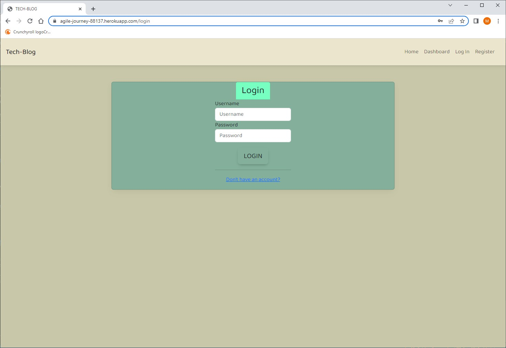
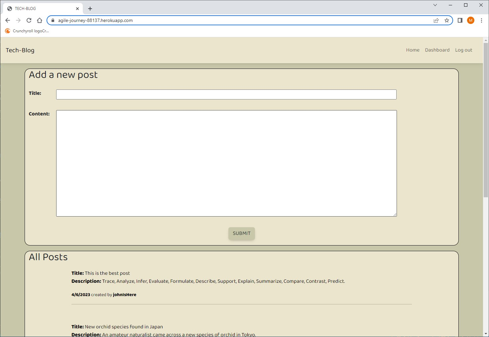
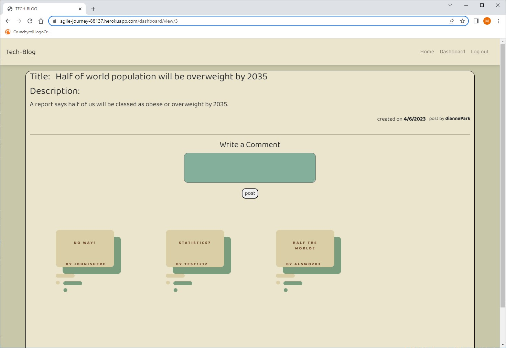

<h1 align="center">MVC TECH BLOG</h1>

    
    
    
    

## Description 💾
This web application is a CMS-style blog created using Model-View-Controllers(MVC). This application is for developers who write about tech and is wanting to publish articles, thoughts, and opinions. In this web application, users can publish their blog posts and comment on other developer's posts. 

## User Story ✉️
~~~
AS A developer who writes about tech
I WANT a CMS-style blog site
SO THAT I can publish articles, blog posts, and my thoughts and opinions
~~~
## Acceptance Criteria 📩
~~~
GIVEN a CMS-style blog site
WHEN I visit the site for the first time
THEN I am presented with the homepage, which includes existing blog posts if any have been posted; navigation links for the homepage and the dashboard; and the option to log in
WHEN I click on the homepage option
THEN I am taken to the homepage
WHEN I click on any other links in the navigation
THEN I am prompted to either sign up or sign in
WHEN I choose to sign up
THEN I am prompted to create a username and password
WHEN I click on the sign-up button
THEN my user credentials are saved and I am logged into the site
WHEN I revisit the site at a later time and choose to sign in
THEN I am prompted to enter my username and password
WHEN I am signed in to the site
THEN I see navigation links for the homepage, the dashboard, and the option to log out
WHEN I click on the homepage option in the navigation
THEN I am taken to the homepage and presented with existing blog posts that include the post title and the date created
WHEN I click on an existing blog post
THEN I am presented with the post title, contents, post creator’s username, and date created for that post and have the option to leave a comment
WHEN I enter a comment and click on the submit button while signed in
THEN the comment is saved and the post is updated to display the comment, the comment creator’s username, and the date created
WHEN I click on the dashboard option in the navigation
THEN I am taken to the dashboard and presented with any blog posts I have already created and the option to add a new blog post
WHEN I click on the button to add a new blog post
THEN I am prompted to enter both a title and contents for my blog post
WHEN I click on the button to create a new blog post
THEN the title and contents of my post are saved and I am taken back to an updated dashboard with my new blog post
WHEN I click on one of my existing posts in the dashboard
THEN I am able to delete or update my post and taken back to an updated dashboard
WHEN I click on the logout option in the navigation
THEN I am signed out of the site
WHEN I am idle on the site for more than a set time
THEN I am able to view comments but I am prompted to log in again before I can add, update, or delete comments
~~~
## Table of Contents 🔍
* [Installation](#installation-)
* [Usage](#usage-)
* [Questions](#questions-)
* [License](#license-)
## Installation 🔨
To install this application to your local, `git clone` this repository into your vscode.

Run `npm install` or `npm i` in order to install the following npm package,

In order to start the application, direct to the MVC_blogging folder type `npm start` in the command line.

The application will be launched on `PORT 3001` of your localhost.
## Usage 💡
Application is launched on heroku: <a href="https://agile-journey-88137.herokuapp.com/">https://agile-journey-88137.herokuapp.com/</a>

Once application is launch you will be directed to sign in or sign up.

Then you will have access to the homepage and dashboard where you can view other posts and your post.

When clicked on a post, you can full view the blog post and view comments/add comments.

## License
MIT License

## Questions ❓

For any Additional questions, Please reach out to: jaecho203@gmail.com

Or visit slchld1 on github! Thank you.
